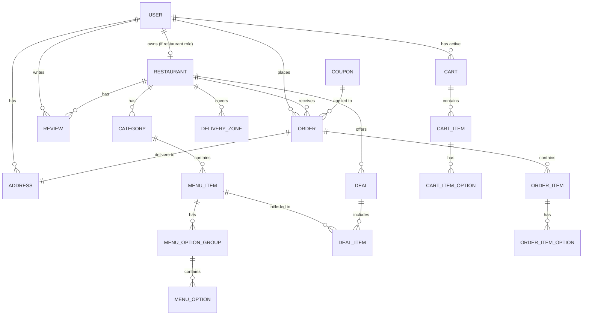

# Cravex - Complete Technical Documentation

## Part 1: Database Design (PostgreSQL + TypeORM)

---

### 1.1 Entity Relationship Diagram



---

### 1.2 Complete Entity Definitions

#### USER Entity

```typescript
@Entity("users")
export class User {
  @PrimaryGeneratedColumn("uuid")
  id: string;

  @Column({ unique: true })
  email: string;

  @Column()
  password: string; // bcrypt hashed

  @Column()
  firstName: string;

  @Column()
  lastName: string;

  @Column({ nullable: true })
  phone: string;

  @Column({ nullable: true })
  avatarUrl: string;

  @Column({
    type: "enum",
    enum: ["superadmin", "restaurant", "customer"],
    default: "customer",
  })
  role: "superadmin" | "restaurant" | "customer";

  @Column({ default: true })
  isActive: boolean;

  @Column({ default: false })
  isEmailVerified: boolean;

  @Column({ nullable: true })
  refreshToken: string; // hashed refresh token

  @CreateDateColumn()
  createdAt: Date;

  @UpdateDateColumn()
  updatedAt: Date;

  // Relations
  @OneToOne(() => Restaurant, (restaurant) => restaurant.owner)
  restaurant: Restaurant;

  @OneToMany(() => Address, (address) => address.user)
  addresses: Address[];

  @OneToMany(() => Order, (order) => order.user)
  orders: Order[];

  @OneToMany(() => Review, (review) => review.user)
  reviews: Review[];

  @OneToOne(() => Cart, (cart) => cart.user)
  cart: Cart;
}
```

#### RESTAURANT Entity

```typescript
@Entity("restaurants")
export class Restaurant {
  @PrimaryGeneratedColumn("uuid")
  id: string;

  @Column()
  name: string;

  @Column({ unique: true })
  slug: string;

  @Column({ type: "text", nullable: true })
  description: string;

  @Column({ nullable: true })
  logoUrl: string;

  @Column({ nullable: true })
  bannerUrl: string;

  @Column({ type: "decimal", precision: 2, scale: 1, default: 0 })
  rating: number;

  @Column({ default: 0 })
  reviewCount: number;

  @Column()
  address: string;

  @Column({ type: "decimal", precision: 10, scale: 8, nullable: true })
  latitude: number;

  @Column({ type: "decimal", precision: 11, scale: 8, nullable: true })
  longitude: number;

  @Column({ nullable: true })
  phone: string;

  @Column({ nullable: true })
  email: string;

  @Column({ type: "jsonb", nullable: true })
  openingHours: {
    monday: { open: string; close: string; isClosed: boolean };
    tuesday: { open: string; close: string; isClosed: boolean };
    wednesday: { open: string; close: string; isClosed: boolean };
    thursday: { open: string; close: string; isClosed: boolean };
    friday: { open: string; close: string; isClosed: boolean };
    saturday: { open: string; close: string; isClosed: boolean };
    sunday: { open: string; close: string; isClosed: boolean };
  };

  @Column({ type: "decimal", precision: 10, scale: 2, default: 0 })
  minimumDelivery: number; // e.g., £20 minimum

  @Column({ type: "decimal", precision: 10, scale: 2, default: 0 })
  deliveryFee: number;

  @Column({ default: 30 })
  deliveryTimeMinutes: number;

  @Column({ default: true })
  isActive: boolean;

  @Column({ default: false })
  isFeatured: boolean;

  @Column({ type: "simple-array", nullable: true })
  cuisineTypes: string[]; // ['Pizza', 'Italian', 'Fast Food']

  @Column({ type: "simple-array", nullable: true })
  tags: string[]; // ['Halal', 'Vegetarian Options']

  @CreateDateColumn()
  createdAt: Date;

  @UpdateDateColumn()
  updatedAt: Date;

  // Relations
  @OneToOne(() => User, (user) => user.restaurant)
  @JoinColumn()
  owner: User;

  @Column()
  ownerId: string;

  @OneToMany(() => Category, (category) => category.restaurant)
  categories: Category[];

  @OneToMany(() => Deal, (deal) => deal.restaurant)
  deals: Deal[];

  @OneToMany(() => DeliveryZone, (zone) => zone.restaurant)
  deliveryZones: DeliveryZone[];

  @OneToMany(() => Order, (order) => order.restaurant)
  orders: Order[];

  @OneToMany(() => Review, (review) => review.restaurant)
  reviews: Review[];
}
```

#### CATEGORY Entity

```typescript
@Entity("categories")
export class Category {
  @PrimaryGeneratedColumn("uuid")
  id: string;

  @Column()
  name: string; // "Burgers", "Pizzas", "Fries", "Cold Drinks"

  @Column({ unique: true })
  slug: string;

  @Column({ nullable: true })
  description: string;

  @Column({ nullable: true })
  imageUrl: string;

  @Column({ default: 0 })
  displayOrder: number;

  @Column({ default: true })
  isActive: boolean;

  // Relations
  @ManyToOne(() => Restaurant, (restaurant) => restaurant.categories)
  restaurant: Restaurant;

  @Column()
  restaurantId: string;

  @OneToMany(() => MenuItem, (menuItem) => menuItem.category)
  menuItems: MenuItem[];
}
```

#### MENU_ITEM Entity

```typescript
@Entity("menu_items")
export class MenuItem {
  @PrimaryGeneratedColumn("uuid")
  id: string;

  @Column()
  name: string; // "Farm House Ultimate Pizza", "Vegetarian Pizza"

  @Column({ type: "text", nullable: true })
  description: string;

  @Column({ type: "decimal", precision: 10, scale: 2 })
  price: number;

  @Column({ nullable: true })
  imageUrl: string;

  @Column({ default: true })
  isAvailable: boolean;

  @Column({ default: false })
  isPopular: boolean;

  @Column({ default: false })
  isVegetarian: boolean;

  @Column({ default: false })
  isVegan: boolean;

  @Column({ default: false })
  isSpicy: boolean;

  @Column({ nullable: true })
  spicyLevel: number; // 1-3

  @Column({ nullable: true })
  calories: number;

  @Column({ nullable: true })
  preparationTime: number; // minutes

  @Column({ type: "simple-array", nullable: true })
  allergens: string[]; // ['gluten', 'dairy', 'nuts']

  @Column({ type: "simple-array", nullable: true })
  tags: string[]; // ['Best Seller', 'New']

  @Column({ default: 0 })
  displayOrder: number;

  @CreateDateColumn()
  createdAt: Date;

  @UpdateDateColumn()
  updatedAt: Date;

  // Relations
  @ManyToOne(() => Category, (category) => category.menuItems)
  category: Category;

  @Column()
  categoryId: string;

  @OneToMany(() => MenuOptionGroup, (group) => group.menuItem)
  optionGroups: MenuOptionGroup[];
}
```

#### MENU_OPTION_GROUP Entity

```typescript
@Entity("menu_option_groups")
export class MenuOptionGroup {
  @PrimaryGeneratedColumn("uuid")
  id: string;

  @Column()
  name: string; // "Vegetable Toppings", "Meat Toppings", "Seafood Toppings", "Size", "Crust Type"

  @Column({ type: "enum", enum: ["single", "multiple"], default: "single" })
  selectionType: "single" | "multiple";

  @Column({ default: 0 })
  minSelections: number;

  @Column({ nullable: true })
  maxSelections: number; // null = unlimited

  @Column({ default: 0 })
  freeSelections: number; // e.g., 4 free toppings

  @Column({ default: false })
  isRequired: boolean;

  @Column({ default: 0 })
  displayOrder: number;

  // Relations
  @ManyToOne(() => MenuItem, (menuItem) => menuItem.optionGroups)
  menuItem: MenuItem;

  @Column()
  menuItemId: string;

  @OneToMany(() => MenuOption, (option) => option.group)
  options: MenuOption[];
}
```

#### MENU_OPTION Entity

```typescript
@Entity("menu_options")
export class MenuOption {
  @PrimaryGeneratedColumn("uuid")
  id: string;

  @Column()
  name: string; // "Cheese", "Mushrooms", "Green Peppers", "Chicken Tikka"

  @Column({ type: "decimal", precision: 10, scale: 2, default: 0 })
  additionalPrice: number; // £0 if within free selections, else £1.50 etc.

  @Column({ default: true })
  isAvailable: boolean;

  @Column({ default: false })
  isDefault: boolean;

  @Column({ nullable: true })
  imageUrl: string;

  @Column({ default: 0 })
  displayOrder: number;

  // Relations
  @ManyToOne(() => MenuOptionGroup, (group) => group.options)
  group: MenuOptionGroup;

  @Column()
  groupId: string;
}
```

#### DEAL Entity

```typescript
@Entity("deals")
export class Deal {
  @PrimaryGeneratedColumn("uuid")
  id: string;

  @Column()
  name: string; // "Meal Deal 1", "Family Bundle"

  @Column({ type: "text", nullable: true })
  description: string;

  @Column({
    type: "enum",
    enum: ["percentage", "fixed_price", "bundle"],
    default: "percentage",
  })
  dealType: "percentage" | "fixed_price" | "bundle";

  @Column({ type: "decimal", precision: 5, scale: 2, nullable: true })
  discountPercent: number; // e.g., 40

  @Column({ type: "decimal", precision: 10, scale: 2, nullable: true })
  fixedPrice: number; // bundle price

  @Column({ nullable: true })
  imageUrl: string;

  @Column({ nullable: true })
  bannerText: string; // "Up to 40% off"

  @Column({ type: "timestamp", nullable: true })
  validFrom: Date;

  @Column({ type: "timestamp", nullable: true })
  validTo: Date;

  @Column({ default: true })
  isActive: boolean;

  @Column({ default: 0 })
  displayOrder: number;

  // Relations
  @ManyToOne(() => Restaurant, (restaurant) => restaurant.deals)
  restaurant: Restaurant;

  @Column()
  restaurantId: string;

  @OneToMany(() => DealItem, (dealItem) => dealItem.deal)
  dealItems: DealItem[];
}
```

#### DEAL_ITEM Entity

```typescript
@Entity("deal_items")
export class DealItem {
  @PrimaryGeneratedColumn("uuid")
  id: string;

  @Column()
  stepNumber: number; // 1, 2, 3 for multi-step deals

  @Column()
  stepTitle: string; // "Select your first Pizza", "Customise Pizza 1"

  @Column({ type: "enum", enum: ["select", "customize"], default: "select" })
  stepType: "select" | "customize";

  @Column({ default: 1 })
  quantity: number; // how many items to select

  @Column({ default: false })
  allowMultipleSame: boolean; // can select same pizza multiple times

  // Relations
  @ManyToOne(() => Deal, (deal) => deal.dealItems)
  deal: Deal;

  @Column()
  dealId: string;

  @ManyToOne(() => MenuItem, { nullable: true })
  menuItem: MenuItem; // if specific item

  @ManyToOne(() => Category, { nullable: true })
  category: Category; // if select from category
}
```

#### DELIVERY_ZONE Entity

```typescript
@Entity("delivery_zones")
export class DeliveryZone {
  @PrimaryGeneratedColumn("uuid")
  id: string;

  @Column()
  postcode: string; // "EN4", "N1", "SW1A"

  @Column({ type: "decimal", precision: 10, scale: 2, default: 0 })
  deliveryFee: number; // zone-specific fee

  @Column({ default: 30 })
  estimatedMinutes: number;

  @Column({ default: true })
  isActive: boolean;

  // Relations
  @ManyToOne(() => Restaurant, (restaurant) => restaurant.deliveryZones)
  restaurant: Restaurant;

  @Column()
  restaurantId: string;
}
```

#### ADDRESS Entity

```typescript
@Entity("addresses")
export class Address {
  @PrimaryGeneratedColumn("uuid")
  id: string;

  @Column()
  label: string; // "Home", "Work", "Other"

  @Column()
  fullAddress: string;

  @Column()
  addressLine1: string;

  @Column({ nullable: true })
  addressLine2: string;

  @Column()
  city: string;

  @Column()
  postcode: string;

  @Column({ nullable: true })
  instructions: string; // delivery instructions

  @Column({ default: false })
  isDefault: boolean;

  // Relations
  @ManyToOne(() => User, (user) => user.addresses)
  user: User;

  @Column()
  userId: string;
}
```

#### CART Entity

```typescript
@Entity("carts")
export class Cart {
  @PrimaryGeneratedColumn("uuid")
  id: string;

  @Column({
    type: "enum",
    enum: ["delivery", "collection"],
    default: "delivery",
  })
  deliveryType: "delivery" | "collection";

  @Column({ nullable: true })
  specialInstructions: string;

  @Column({ nullable: true })
  couponCode: string;

  @Column({ type: "decimal", precision: 10, scale: 2, default: 0 })
  discountAmount: number;

  @UpdateDateColumn()
  updatedAt: Date;

  // Relations
  @OneToOne(() => User, (user) => user.cart)
  @JoinColumn()
  user: User;

  @Column()
  userId: string;

  @ManyToOne(() => Restaurant, { nullable: true })
  restaurant: Restaurant;

  @Column({ nullable: true })
  restaurantId: string;

  @OneToMany(() => CartItem, (cartItem) => cartItem.cart, { cascade: true })
  items: CartItem[];
}
```

#### CART_ITEM Entity

```typescript
@Entity("cart_items")
export class CartItem {
  @PrimaryGeneratedColumn("uuid")
  id: string;

  @Column({ default: 1 })
  quantity: number;

  @Column({ type: "decimal", precision: 10, scale: 2 })
  unitPrice: number; // price at time of adding

  @Column({ nullable: true })
  specialInstructions: string;

  @CreateDateColumn()
  addedAt: Date;

  // Relations
  @ManyToOne(() => Cart, (cart) => cart.items, { onDelete: "CASCADE" })
  cart: Cart;

  @Column()
  cartId: string;

  @ManyToOne(() => MenuItem)
  menuItem: MenuItem;

  @Column()
  menuItemId: string;

  @OneToMany(() => CartItemOption, (option) => option.cartItem, {
    cascade: true,
  })
  selectedOptions: CartItemOption[];
}
```

#### CART_ITEM_OPTION Entity

```typescript
@Entity("cart_item_options")
export class CartItemOption {
  @PrimaryGeneratedColumn("uuid")
  id: string;

  @Column({ type: "decimal", precision: 10, scale: 2, default: 0 })
  additionalPrice: number;

  // Relations
  @ManyToOne(() => CartItem, (cartItem) => cartItem.selectedOptions, {
    onDelete: "CASCADE",
  })
  cartItem: CartItem;

  @Column()
  cartItemId: string;

  @ManyToOne(() => MenuOption)
  menuOption: MenuOption;

  @Column()
  menuOptionId: string;
}
```

#### ORDER Entity

```typescript
@Entity("orders")
export class Order {
  @PrimaryGeneratedColumn("uuid")
  id: string;

  @Column({ unique: true })
  orderNumber: string; // "ORD-20260114-001"

  @Column({
    type: "enum",
    enum: [
      "pending",
      "confirmed",
      "preparing",
      "ready",
      "out_for_delivery",
      "delivered",
      "cancelled",
    ],
    default: "pending",
  })
  status:
    | "pending"
    | "confirmed"
    | "preparing"
    | "ready"
    | "out_for_delivery"
    | "delivered"
    | "cancelled";

  @Column({
    type: "enum",
    enum: ["delivery", "collection"],
    default: "delivery",
  })
  deliveryType: "delivery" | "collection";

  @Column({ type: "decimal", precision: 10, scale: 2 })
  subtotal: number;

  @Column({ type: "decimal", precision: 10, scale: 2, default: 0 })
  discount: number;

  @Column({ type: "decimal", precision: 10, scale: 2, default: 0 })
  deliveryFee: number;

  @Column({ type: "decimal", precision: 10, scale: 2 })
  total: number;

  @Column({ nullable: true })
  couponCode: string;

  @Column({ nullable: true })
  specialInstructions: string;

  @Column({ nullable: true })
  estimatedDeliveryTime: Date;

  @Column({ nullable: true })
  deliveredAt: Date;

  @Column({ nullable: true })
  cancelledAt: Date;

  @Column({ nullable: true })
  cancellationReason: string;

  @CreateDateColumn()
  createdAt: Date;

  @UpdateDateColumn()
  updatedAt: Date;

  // Relations
  @ManyToOne(() => User, (user) => user.orders)
  user: User;

  @Column()
  userId: string;

  @ManyToOne(() => Restaurant, (restaurant) => restaurant.orders)
  restaurant: Restaurant;

  @Column()
  restaurantId: string;

  @ManyToOne(() => Address, { nullable: true })
  deliveryAddress: Address;

  @Column({ nullable: true })
  deliveryAddressId: string;

  @ManyToOne(() => Coupon, { nullable: true })
  coupon: Coupon;

  @OneToMany(() => OrderItem, (orderItem) => orderItem.order, { cascade: true })
  items: OrderItem[];
}
```

#### ORDER_ITEM Entity

```typescript
@Entity("order_items")
export class OrderItem {
  @PrimaryGeneratedColumn("uuid")
  id: string;

  @Column()
  menuItemName: string; // snapshot

  @Column()
  quantity: number;

  @Column({ type: "decimal", precision: 10, scale: 2 })
  unitPrice: number;

  @Column({ type: "decimal", precision: 10, scale: 2 })
  totalPrice: number;

  @Column({ nullable: true })
  specialInstructions: string;

  // Relations
  @ManyToOne(() => Order, (order) => order.items, { onDelete: "CASCADE" })
  order: Order;

  @Column()
  orderId: string;

  @ManyToOne(() => MenuItem)
  menuItem: MenuItem;

  @Column()
  menuItemId: string;

  @OneToMany(() => OrderItemOption, (option) => option.orderItem, {
    cascade: true,
  })
  selectedOptions: OrderItemOption[];
}
```

#### ORDER_ITEM_OPTION Entity

```typescript
@Entity("order_item_options")
export class OrderItemOption {
  @PrimaryGeneratedColumn("uuid")
  id: string;

  @Column()
  optionName: string; // snapshot

  @Column({ type: "decimal", precision: 10, scale: 2 })
  additionalPrice: number;

  // Relations
  @ManyToOne(() => OrderItem, (orderItem) => orderItem.selectedOptions, {
    onDelete: "CASCADE",
  })
  orderItem: OrderItem;

  @Column()
  orderItemId: string;

  @ManyToOne(() => MenuOption)
  menuOption: MenuOption;

  @Column()
  menuOptionId: string;
}
```

#### COUPON Entity

```typescript
@Entity("coupons")
export class Coupon {
  @PrimaryGeneratedColumn("uuid")
  id: string;

  @Column({ unique: true })
  code: string; // "SAVE20", "WELCOME10"

  @Column({
    type: "enum",
    enum: ["percentage", "fixed"],
    default: "percentage",
  })
  discountType: "percentage" | "fixed";

  @Column({ type: "decimal", precision: 10, scale: 2 })
  discountValue: number;

  @Column({ type: "decimal", precision: 10, scale: 2, nullable: true })
  minimumOrder: number;

  @Column({ type: "decimal", precision: 10, scale: 2, nullable: true })
  maxDiscount: number; // cap for percentage discounts

  @Column({ type: "timestamp", nullable: true })
  validFrom: Date;

  @Column({ type: "timestamp", nullable: true })
  validTo: Date;

  @Column({ nullable: true })
  maxUsageCount: number; // null = unlimited

  @Column({ default: 0 })
  usageCount: number;

  @Column({ default: true })
  isActive: boolean;

  // Relations
  @ManyToOne(() => Restaurant, { nullable: true })
  restaurant: Restaurant; // null = site-wide coupon

  @Column({ nullable: true })
  restaurantId: string;
}
```

#### REVIEW Entity

```typescript
@Entity("reviews")
export class Review {
  @PrimaryGeneratedColumn("uuid")
  id: string;

  @Column({ type: "int" })
  rating: number; // 1-5

  @Column({ type: "text", nullable: true })
  comment: string;

  @Column({ default: false })
  isVerifiedPurchase: boolean;

  @CreateDateColumn()
  createdAt: Date;

  // Relations
  @ManyToOne(() => User, (user) => user.reviews)
  user: User;

  @Column()
  userId: string;

  @ManyToOne(() => Restaurant, (restaurant) => restaurant.reviews)
  restaurant: Restaurant;

  @Column()
  restaurantId: string;

  @ManyToOne(() => Order, { nullable: true })
  order: Order;

  @Column({ nullable: true })
  orderId: string;
}
```

---

## Part 2: DTOs (Data Transfer Objects)

### 2.1 Authentication DTOs

```typescript
// RegisterDto
export class RegisterDto {
  @IsEmail()
  email: string;

  @IsString()
  @MinLength(8)
  password: string;

  @IsString()
  firstName: string;

  @IsString()
  lastName: string;

  @IsOptional()
  @IsString()
  phone?: string;

  @IsEnum(["restaurant", "customer"])
  role: "restaurant" | "customer";
}

// LoginDto
export class LoginDto {
  @IsEmail()
  email: string;

  @IsString()
  password: string;
}

// AuthResponseDto
export class AuthResponseDto {
  accessToken: string;
  refreshToken: string;
  user: UserResponseDto;
}

// UserResponseDto
export class UserResponseDto {
  id: string;
  email: string;
  firstName: string;
  lastName: string;
  phone: string;
  role: string;
  avatarUrl: string;
  isEmailVerified: boolean;
  createdAt: Date;
}

// RefreshTokenDto
export class RefreshTokenDto {
  @IsString()
  refreshToken: string;
}
```

### 2.2 Restaurant DTOs

```typescript
// CreateRestaurantDto
export class CreateRestaurantDto {
  @IsString()
  name: string;

  @IsString()
  @IsOptional()
  description?: string;

  @IsString()
  address: string;

  @IsOptional()
  @IsNumber()
  latitude?: number;

  @IsOptional()
  @IsNumber()
  longitude?: number;

  @IsOptional()
  @IsString()
  phone?: string;

  @IsOptional()
  @IsString()
  email?: string;

  @IsOptional()
  openingHours?: Record<
    string,
    { open: string; close: string; isClosed: boolean }
  >;

  @IsNumber()
  @Min(0)
  minimumDelivery: number;

  @IsNumber()
  @Min(0)
  deliveryFee: number;

  @IsNumber()
  @Min(1)
  deliveryTimeMinutes: number;

  @IsOptional()
  @IsArray()
  cuisineTypes?: string[];

  @IsOptional()
  @IsArray()
  tags?: string[];
}

// UpdateRestaurantDto
export class UpdateRestaurantDto extends PartialType(CreateRestaurantDto) {}

// RestaurantResponseDto
export class RestaurantResponseDto {
  id: string;
  name: string;
  slug: string;
  description: string;
  logoUrl: string;
  bannerUrl: string;
  rating: number;
  reviewCount: number;
  address: string;
  minimumDelivery: number;
  deliveryFee: number;
  deliveryTimeMinutes: number;
  isOpen: boolean; // computed
  cuisineTypes: string[];
  tags: string[];
}

// RestaurantDetailDto
export class RestaurantDetailDto extends RestaurantResponseDto {
  categories: CategoryWithItemsDto[];
  deals: DealResponseDto[];
  openingHours: Record<string, any>;
  latitude: number;
  longitude: number;
  phone: string;
  email: string;
}

// RestaurantListQueryDto
export class RestaurantListQueryDto {
  @IsOptional()
  @IsString()
  search?: string;

  @IsOptional()
  @IsString()
  postcode?: string;

  @IsOptional()
  @IsArray()
  cuisineTypes?: string[];

  @IsOptional()
  @IsNumber()
  page?: number = 1;

  @IsOptional()
  @IsNumber()
  limit?: number = 20;

  @IsOptional()
  @IsString()
  sortBy?: "rating" | "deliveryTime" | "minimumDelivery";

  @IsOptional()
  @IsString()
  sortOrder?: "asc" | "desc";
}
```

### 2.3 Menu DTOs

```typescript
// CreateCategoryDto
export class CreateCategoryDto {
  @IsString()
  name: string;

  @IsOptional()
  @IsString()
  description?: string;

  @IsOptional()
  @IsNumber()
  displayOrder?: number;
}

// CategoryWithItemsDto
export class CategoryWithItemsDto {
  id: string;
  name: string;
  slug: string;
  displayOrder: number;
  items: MenuItemResponseDto[];
}

// CreateMenuItemDto
export class CreateMenuItemDto {
  @IsString()
  name: string;

  @IsOptional()
  @IsString()
  description?: string;

  @IsNumber()
  @Min(0)
  price: number;

  @IsUUID()
  categoryId: string;

  @IsOptional()
  @IsBoolean()
  isVegetarian?: boolean;

  @IsOptional()
  @IsBoolean()
  isVegan?: boolean;

  @IsOptional()
  @IsBoolean()
  isSpicy?: boolean;

  @IsOptional()
  @IsNumber()
  spicyLevel?: number;

  @IsOptional()
  @IsNumber()
  calories?: number;

  @IsOptional()
  @IsArray()
  allergens?: string[];

  @IsOptional()
  @IsArray()
  tags?: string[];
}

// MenuItemResponseDto
export class MenuItemResponseDto {
  id: string;
  name: string;
  description: string;
  price: number;
  imageUrl: string;
  isAvailable: boolean;
  isPopular: boolean;
  isVegetarian: boolean;
  isVegan: boolean;
  isSpicy: boolean;
  spicyLevel: number;
  tags: string[];
  optionGroups: MenuOptionGroupResponseDto[];
}

// CreateMenuOptionGroupDto
export class CreateMenuOptionGroupDto {
  @IsString()
  name: string;

  @IsEnum(["single", "multiple"])
  selectionType: "single" | "multiple";

  @IsNumber()
  @Min(0)
  minSelections: number;

  @IsOptional()
  @IsNumber()
  maxSelections?: number;

  @IsNumber()
  @Min(0)
  freeSelections: number;

  @IsBoolean()
  isRequired: boolean;

  @IsArray()
  @ValidateNested({ each: true })
  @Type(() => CreateMenuOptionDto)
  options: CreateMenuOptionDto[];
}

// CreateMenuOptionDto
export class CreateMenuOptionDto {
  @IsString()
  name: string;

  @IsNumber()
  @Min(0)
  additionalPrice: number;

  @IsOptional()
  @IsBoolean()
  isDefault?: boolean;
}

// MenuOptionGroupResponseDto
export class MenuOptionGroupResponseDto {
  id: string;
  name: string;
  selectionType: "single" | "multiple";
  minSelections: number;
  maxSelections: number;
  freeSelections: number;
  isRequired: boolean;
  options: MenuOptionResponseDto[];
}

// MenuOptionResponseDto
export class MenuOptionResponseDto {
  id: string;
  name: string;
  additionalPrice: number;
  isAvailable: boolean;
  isDefault: boolean;
}
```

### 2.4 Cart DTOs

```typescript
// AddToCartDto
export class AddToCartDto {
  @IsUUID()
  menuItemId: string;

  @IsNumber()
  @Min(1)
  quantity: number;

  @IsOptional()
  @IsArray()
  @ValidateNested({ each: true })
  @Type(() => SelectedOptionDto)
  selectedOptions?: SelectedOptionDto[];

  @IsOptional()
  @IsString()
  specialInstructions?: string;
}

// SelectedOptionDto
export class SelectedOptionDto {
  @IsUUID()
  optionGroupId: string;

  @IsArray()
  @IsUUID("4", { each: true })
  optionIds: string[];
}

// UpdateCartItemDto
export class UpdateCartItemDto {
  @IsOptional()
  @IsNumber()
  @Min(1)
  quantity?: number;

  @IsOptional()
  @IsArray()
  @ValidateNested({ each: true })
  @Type(() => SelectedOptionDto)
  selectedOptions?: SelectedOptionDto[];

  @IsOptional()
  @IsString()
  specialInstructions?: string;
}

// CartResponseDto
export class CartResponseDto {
  id: string;
  restaurant: RestaurantResponseDto;
  items: CartItemResponseDto[];
  deliveryType: "delivery" | "collection";
  couponCode: string;
  subtotal: number;
  discount: number;
  deliveryFee: number;
  total: number;
  freeItemEligible: boolean;
  minimumDeliveryMet: boolean;
  minimumDeliveryAmount: number;
  amountToMinimum: number;
}

// CartItemResponseDto
export class CartItemResponseDto {
  id: string;
  menuItem: MenuItemResponseDto;
  quantity: number;
  unitPrice: number;
  totalPrice: number;
  selectedOptions: CartItemOptionResponseDto[];
  specialInstructions: string;
}

// CartItemOptionResponseDto
export class CartItemOptionResponseDto {
  id: string;
  optionName: string;
  additionalPrice: number;
}

// ApplyCouponDto
export class ApplyCouponDto {
  @IsString()
  code: string;
}

// SetDeliveryTypeDto
export class SetDeliveryTypeDto {
  @IsEnum(["delivery", "collection"])
  deliveryType: "delivery" | "collection";
}
```

### 2.5 Order DTOs

```typescript
// CreateOrderDto
export class CreateOrderDto {
  @IsOptional()
  @IsUUID()
  deliveryAddressId?: string;

  @IsOptional()
  @IsString()
  specialInstructions?: string;
}

// OrderResponseDto
export class OrderResponseDto {
  id: string;
  orderNumber: string;
  status: string;
  deliveryType: "delivery" | "collection";
  restaurant: RestaurantResponseDto;
  items: OrderItemResponseDto[];
  subtotal: number;
  discount: number;
  deliveryFee: number;
  total: number;
  deliveryAddress: AddressResponseDto;
  estimatedDeliveryTime: Date;
  createdAt: Date;
}

// OrderItemResponseDto
export class OrderItemResponseDto {
  menuItemName: string;
  quantity: number;
  unitPrice: number;
  totalPrice: number;
  selectedOptions: string[];
  specialInstructions: string;
}

// UpdateOrderStatusDto (Restaurant/Admin)
export class UpdateOrderStatusDto {
  @IsEnum([
    "confirmed",
    "preparing",
    "ready",
    "out_for_delivery",
    "delivered",
    "cancelled",
  ])
  status: string;

  @IsOptional()
  @IsNumber()
  estimatedMinutes?: number;

  @IsOptional()
  @IsString()
  cancellationReason?: string;
}

// OrderListQueryDto
export class OrderListQueryDto {
  @IsOptional()
  @IsEnum([
    "pending",
    "confirmed",
    "preparing",
    "ready",
    "out_for_delivery",
    "delivered",
    "cancelled",
  ])
  status?: string;

  @IsOptional()
  @IsDateString()
  fromDate?: string;

  @IsOptional()
  @IsDateString()
  toDate?: string;

  @IsOptional()
  @IsNumber()
  page?: number = 1;

  @IsOptional()
  @IsNumber()
  limit?: number = 20;
}
```

### 2.6 Delivery DTOs

```typescript
// ValidatePostcodeDto
export class ValidatePostcodeDto {
  @IsString()
  postcode: string;

  @IsOptional()
  @IsUUID()
  restaurantId?: string;
}

// PostcodeValidationResponseDto
export class PostcodeValidationResponseDto {
  isDeliverable: boolean;
  postcode: string;
  formattedPostcode: string;
  deliveryFee: number;
  estimatedMinutes: number;
  restaurants: RestaurantResponseDto[]; // if no restaurantId provided
  errorMessage?: string; // "Sorry, we don't do delivery to your area"
}
```

---

## Part 3: CQRS Commands & Queries

### 3.1 Authentication Module

```typescript
// Commands
export class RegisterUserCommand {
  constructor(public readonly dto: RegisterDto) {}
}

export class LoginUserCommand {
  constructor(public readonly dto: LoginDto) {}
}

export class RefreshTokenCommand {
  constructor(public readonly refreshToken: string) {}
}

export class LogoutUserCommand {
  constructor(public readonly userId: string) {}
}

// Command Handlers
@CommandHandler(RegisterUserCommand)
export class RegisterUserHandler
  implements ICommandHandler<RegisterUserCommand>
{
  async execute(command: RegisterUserCommand): Promise<AuthResponseDto> {
    // 1. Check if email exists
    // 2. Hash password with bcrypt
    // 3. Create user
    // 4. Generate access + refresh tokens
    // 5. Store hashed refresh token
    // 6. Return tokens + user
  }
}

@CommandHandler(LoginUserCommand)
export class LoginUserHandler implements ICommandHandler<LoginUserCommand> {
  async execute(command: LoginUserCommand): Promise<AuthResponseDto> {
    // 1. Find user by email
    // 2. Compare password with bcrypt
    // 3. Generate tokens
    // 4. Update refresh token in DB
    // 5. Return tokens + user
  }
}

// Queries
export class GetCurrentUserQuery {
  constructor(public readonly userId: string) {}
}

@QueryHandler(GetCurrentUserQuery)
export class GetCurrentUserHandler
  implements IQueryHandler<GetCurrentUserQuery>
{
  async execute(query: GetCurrentUserQuery): Promise<UserResponseDto> {
    // Return user profile
  }
}
```

### 3.2 Restaurant Module

```typescript
// Queries
export class GetRestaurantsQuery {
  constructor(public readonly filters: RestaurantListQueryDto) {}
}

export class GetRestaurantBySlugQuery {
  constructor(public readonly slug: string) {}
}

export class GetRestaurantDealsQuery {
  constructor(public readonly restaurantId: string) {}
}

export class SearchRestaurantsQuery {
  constructor(
    public readonly searchTerm: string,
    public readonly postcode?: string
  ) {}
}

// Query Handlers
@QueryHandler(GetRestaurantsQuery)
export class GetRestaurantsHandler {
  async execute(
    query: GetRestaurantsQuery
  ): Promise<PaginatedResponse<RestaurantResponseDto>> {
    // 1. Apply filters (cuisine, postcode delivery area)
    // 2. Apply sorting
    // 3. Paginate
    // 4. Map to DTOs with computed isOpen field
  }
}

@QueryHandler(GetRestaurantBySlugQuery)
export class GetRestaurantBySlugHandler {
  async execute(query: GetRestaurantBySlugQuery): Promise<RestaurantDetailDto> {
    // 1. Find restaurant with relations (categories, items, deals, options)
    // 2. Check if currently open based on opening hours
    // 3. Map to detailed DTO
  }
}

// Commands (Restaurant Owner)
export class CreateRestaurantCommand {
  constructor(
    public readonly ownerId: string,
    public readonly dto: CreateRestaurantDto
  ) {}
}

export class UpdateRestaurantCommand {
  constructor(
    public readonly restaurantId: string,
    public readonly ownerId: string,
    public readonly dto: UpdateRestaurantDto
  ) {}
}

export class UploadRestaurantImageCommand {
  constructor(
    public readonly restaurantId: string,
    public readonly imageType: "logo" | "banner",
    public readonly file: Express.Multer.File
  ) {}
}
```

### 3.3 Menu Module

```typescript
// Queries
export class GetMenuByRestaurantQuery {
  constructor(public readonly restaurantId: string) {}
}

export class GetMenuItemDetailQuery {
  constructor(public readonly menuItemId: string) {}
}

export class GetCategoriesQuery {
  constructor(public readonly restaurantId: string) {}
}

// Query Handlers
@QueryHandler(GetMenuByRestaurantQuery)
export class GetMenuByRestaurantHandler {
  async execute(
    query: GetMenuByRestaurantQuery
  ): Promise<CategoryWithItemsDto[]> {
    // 1. Get categories with items ordered by displayOrder
    // 2. For each item, get option groups and options
    // 3. Return structured menu
  }
}

// Commands (Restaurant Owner)
export class CreateCategoryCommand {
  constructor(
    public readonly restaurantId: string,
    public readonly dto: CreateCategoryDto
  ) {}
}

export class UpdateCategoryCommand {
  constructor(
    public readonly categoryId: string,
    public readonly dto: UpdateCategoryDto
  ) {}
}

export class DeleteCategoryCommand {
  constructor(public readonly categoryId: string) {}
}

export class ReorderCategoriesCommand {
  constructor(
    public readonly restaurantId: string,
    public readonly categoryIds: string[] // new order
  ) {}
}

export class CreateMenuItemCommand {
  constructor(
    public readonly restaurantId: string,
    public readonly dto: CreateMenuItemDto
  ) {}
}

export class UpdateMenuItemCommand {
  constructor(
    public readonly menuItemId: string,
    public readonly dto: UpdateMenuItemDto
  ) {}
}

export class DeleteMenuItemCommand {
  constructor(public readonly menuItemId: string) {}
}

export class ToggleMenuItemAvailabilityCommand {
  constructor(public readonly menuItemId: string) {}
}

export class CreateMenuOptionGroupCommand {
  constructor(
    public readonly menuItemId: string,
    public readonly dto: CreateMenuOptionGroupDto
  ) {}
}

export class UpdateMenuOptionGroupCommand {
  constructor(
    public readonly groupId: string,
    public readonly dto: UpdateMenuOptionGroupDto
  ) {}
}

export class DeleteMenuOptionGroupCommand {
  constructor(public readonly groupId: string) {}
}
```

### 3.4 Cart Module

```typescript
// Queries
export class GetCartQuery {
  constructor(public readonly userId: string) {}
}

// Query Handler
@QueryHandler(GetCartQuery)
export class GetCartHandler {
  async execute(query: GetCartQuery): Promise<CartResponseDto> {
    // 1. Get cart with items and options
    // 2. Calculate subtotal (sum of item prices + option prices)
    // 3. Apply coupon discount if any
    // 4. Calculate delivery fee if delivery type
    // 5. Check minimum delivery threshold
    // 6. Return complete cart DTO
  }
}

// Commands
export class AddToCartCommand {
  constructor(
    public readonly userId: string,
    public readonly restaurantId: string,
    public readonly dto: AddToCartDto
  ) {}
}

export class UpdateCartItemCommand {
  constructor(
    public readonly userId: string,
    public readonly cartItemId: string,
    public readonly dto: UpdateCartItemDto
  ) {}
}

export class RemoveFromCartCommand {
  constructor(
    public readonly userId: string,
    public readonly cartItemId: string
  ) {}
}

export class ClearCartCommand {
  constructor(public readonly userId: string) {}
}

export class ApplyCouponCommand {
  constructor(public readonly userId: string, public readonly code: string) {}
}

export class RemoveCouponCommand {
  constructor(public readonly userId: string) {}
}

export class SetDeliveryTypeCommand {
  constructor(
    public readonly userId: string,
    public readonly deliveryType: "delivery" | "collection"
  ) {}
}

export class SelectFreeItemCommand {
  constructor(
    public readonly userId: string,
    public readonly menuItemId: string
  ) {}
}

// Command Handlers
@CommandHandler(AddToCartCommand)
export class AddToCartHandler {
  async execute(command: AddToCartCommand): Promise<CartResponseDto> {
    // 1. Validate menu item exists and is available
    // 2. Validate selected options against option groups
    // 3. If cart has items from different restaurant, clear it first
    // 4. Calculate item price with options
    // 5. Add to cart
    // 6. Return updated cart
  }
}

@CommandHandler(ApplyCouponCommand)
export class ApplyCouponHandler {
  async execute(command: ApplyCouponCommand): Promise<CartResponseDto> {
    // 1. Find coupon by code
    // 2. Validate: active, not expired, usage count, minimum order
    // 3. Calculate discount
    // 4. Update cart
    // 5. Return updated cart
  }
}
```

### 3.5 Order Module

```typescript
// Queries
export class GetOrdersQuery {
  constructor(
    public readonly userId: string,
    public readonly filters: OrderListQueryDto
  ) {}
}

export class GetOrderByIdQuery {
  constructor(
    public readonly orderId: string,
    public readonly userId: string
  ) {}
}

export class GetRestaurantOrdersQuery {
  constructor(
    public readonly restaurantId: string,
    public readonly filters: OrderListQueryDto
  ) {}
}

// Query Handlers
@QueryHandler(GetOrdersQuery)
export class GetOrdersHandler {
  async execute(
    query: GetOrdersQuery
  ): Promise<PaginatedResponse<OrderResponseDto>> {
    // Get user's order history with filters
  }
}

// Commands
export class CreateOrderCommand {
  constructor(
    public readonly userId: string,
    public readonly dto: CreateOrderDto
  ) {}
}

export class UpdateOrderStatusCommand {
  constructor(
    public readonly orderId: string,
    public readonly updaterId: string,
    public readonly dto: UpdateOrderStatusDto
  ) {}
}

export class CancelOrderCommand {
  constructor(
    public readonly orderId: string,
    public readonly userId: string,
    public readonly reason: string
  ) {}
}

// Command Handlers
@CommandHandler(CreateOrderCommand)
export class CreateOrderHandler {
  async execute(command: CreateOrderCommand): Promise<OrderResponseDto> {
    // 1. Get cart with items
    // 2. Validate cart is not empty
    // 3. Validate minimum delivery met (if delivery)
    // 4. Validate delivery address (if delivery)
    // 5. Generate order number (ORD-YYYYMMDD-XXX)
    // 6. Create order from cart items (snapshot item names, prices)
    // 7. Clear cart
    // 8. Increment coupon usage count if used
    // 9. Return order confirmation
  }
}

@CommandHandler(UpdateOrderStatusCommand)
export class UpdateOrderStatusHandler {
  async execute(command: UpdateOrderStatusCommand): Promise<OrderResponseDto> {
    // 1. Verify updater is restaurant owner or admin
    // 2. Validate status transition is valid
    // 3. Update status and timestamp
    // 4. Send notification to customer (future)
  }
}
```

### 3.6 Delivery Module

```typescript
// Queries
export class ValidatePostcodeQuery {
  constructor(public readonly dto: ValidatePostcodeDto) {}
}

export class GetDeliveryZonesQuery {
  constructor(public readonly restaurantId: string) {}
}

// Query Handlers
@QueryHandler(ValidatePostcodeQuery)
export class ValidatePostcodeHandler {
  async execute(
    query: ValidatePostcodeQuery
  ): Promise<PostcodeValidationResponseDto> {
    // 1. Normalize postcode (uppercase, remove spaces)
    // 2. Extract outward code (first part: SW1A, N1, etc.)
    // 3. If restaurantId provided:
    //    - Check if restaurant delivers to this postcode
    //    - Return delivery fee and time
    // 4. If no restaurantId:
    //    - Find all restaurants delivering to this area
    //    - Return restaurant list
  }
}

// Commands (Restaurant Owner)
export class AddDeliveryZoneCommand {
  constructor(
    public readonly restaurantId: string,
    public readonly postcode: string,
    public readonly deliveryFee: number,
    public readonly estimatedMinutes: number
  ) {}
}

export class RemoveDeliveryZoneCommand {
  constructor(
    public readonly restaurantId: string,
    public readonly zoneId: string
  ) {}
}

export class UpdateDeliveryZoneCommand {
  constructor(
    public readonly zoneId: string,
    public readonly deliveryFee?: number,
    public readonly estimatedMinutes?: number
  ) {}
}
```

### 3.7 Review Module

```typescript
// Queries
export class GetRestaurantReviewsQuery {
  constructor(
    public readonly restaurantId: string,
    public readonly page: number = 1,
    public readonly limit: number = 10
  ) {}
}

// Commands
export class CreateReviewCommand {
  constructor(
    public readonly userId: string,
    public readonly restaurantId: string,
    public readonly orderId: string,
    public readonly rating: number,
    public readonly comment?: string
  ) {}
}

// Command Handler
@CommandHandler(CreateReviewCommand)
export class CreateReviewHandler {
  async execute(command: CreateReviewCommand): Promise<ReviewResponseDto> {
    // 1. Verify order belongs to user and restaurant
    // 2. Check order is delivered
    // 3. Check no existing review for this order
    // 4. Create review
    // 5. Update restaurant rating average
    // 6. Increment review count
  }
}
```

### 3.8 Admin Module (Superadmin)

```typescript
// Queries
export class GetAllUsersQuery {
  constructor(public readonly filters: UserListQueryDto) {}
}

export class GetAllRestaurantsQuery {
  constructor(public readonly filters: AdminRestaurantQueryDto) {}
}

export class GetDashboardStatsQuery {
  constructor() {}
}

// Commands
export class ToggleUserStatusCommand {
  constructor(public readonly userId: string) {}
}

export class ToggleRestaurantStatusCommand {
  constructor(public readonly restaurantId: string) {}
}

export class FeatureRestaurantCommand {
  constructor(
    public readonly restaurantId: string,
    public readonly isFeatured: boolean
  ) {}
}

export class CreateSiteWideCouponCommand {
  constructor(public readonly dto: CreateCouponDto) {}
}
```

---

## Part 4: API Endpoints

### 4.1 Authentication Endpoints

| Method | Endpoint                | Auth   | Description              |
| ------ | ----------------------- | ------ | ------------------------ |
| POST   | `/auth/register`        | Public | Register new user        |
| POST   | `/auth/login`           | Public | Login user               |
| POST   | `/auth/refresh`         | Public | Refresh access token     |
| POST   | `/auth/logout`          | JWT    | Logout user              |
| GET    | `/auth/me`              | JWT    | Get current user profile |
| PATCH  | `/auth/me`              | JWT    | Update profile           |
| POST   | `/auth/change-password` | JWT    | Change password          |

### 4.2 Restaurant Endpoints

| Method | Endpoint                   | Auth   | Role       | Description              |
| ------ | -------------------------- | ------ | ---------- | ------------------------ |
| GET    | `/restaurants`             | Public | -          | List all restaurants     |
| GET    | `/restaurants/search`      | Public | -          | Search restaurants       |
| GET    | `/restaurants/featured`    | Public | -          | Get featured restaurants |
| GET    | `/restaurants/:slug`       | Public | -          | Get restaurant detail    |
| GET    | `/restaurants/:id/menu`    | Public | -          | Get restaurant menu      |
| GET    | `/restaurants/:id/deals`   | Public | -          | Get restaurant deals     |
| GET    | `/restaurants/:id/reviews` | Public | -          | Get restaurant reviews   |
| POST   | `/restaurants`             | JWT    | restaurant | Create restaurant        |
| PATCH  | `/restaurants/:id`         | JWT    | restaurant | Update restaurant        |
| POST   | `/restaurants/:id/logo`    | JWT    | restaurant | Upload logo              |
| POST   | `/restaurants/:id/banner`  | JWT    | restaurant | Upload banner            |

### 4.3 Menu Endpoints

| Method | Endpoint                        | Auth   | Role       | Description         |
| ------ | ------------------------------- | ------ | ---------- | ------------------- |
| GET    | `/restaurants/:id/categories`   | Public | -          | Get categories      |
| POST   | `/restaurants/:id/categories`   | JWT    | restaurant | Create category     |
| PATCH  | `/categories/:id`               | JWT    | restaurant | Update category     |
| DELETE | `/categories/:id`               | JWT    | restaurant | Delete category     |
| POST   | `/categories/reorder`           | JWT    | restaurant | Reorder categories  |
| POST   | `/restaurants/:id/menu-items`   | JWT    | restaurant | Create menu item    |
| PATCH  | `/menu-items/:id`               | JWT    | restaurant | Update menu item    |
| DELETE | `/menu-items/:id`               | JWT    | restaurant | Delete menu item    |
| PATCH  | `/menu-items/:id/toggle`        | JWT    | restaurant | Toggle availability |
| POST   | `/menu-items/:id/option-groups` | JWT    | restaurant | Add option group    |
| PATCH  | `/option-groups/:id`            | JWT    | restaurant | Update option group |
| DELETE | `/option-groups/:id`            | JWT    | restaurant | Delete option group |

### 4.4 Cart Endpoints

| Method | Endpoint              | Auth | Description             |
| ------ | --------------------- | ---- | ----------------------- |
| GET    | `/cart`               | JWT  | Get current cart        |
| POST   | `/cart/items`         | JWT  | Add item to cart        |
| PATCH  | `/cart/items/:id`     | JWT  | Update cart item        |
| DELETE | `/cart/items/:id`     | JWT  | Remove cart item        |
| DELETE | `/cart`               | JWT  | Clear cart              |
| POST   | `/cart/coupon`        | JWT  | Apply coupon            |
| DELETE | `/cart/coupon`        | JWT  | Remove coupon           |
| PATCH  | `/cart/delivery-type` | JWT  | Set delivery/collection |
| POST   | `/cart/free-item`     | JWT  | Select free item        |

### 4.5 Order Endpoints

| Method | Endpoint             | Auth | Role       | Description            |
| ------ | -------------------- | ---- | ---------- | ---------------------- |
| POST   | `/orders`            | JWT  | customer   | Create order from cart |
| GET    | `/orders`            | JWT  | customer   | Get user's orders      |
| GET    | `/orders/:id`        | JWT  | customer   | Get order detail       |
| POST   | `/orders/:id/cancel` | JWT  | customer   | Cancel order           |
| GET    | `/restaurant/orders` | JWT  | restaurant | Get restaurant orders  |
| PATCH  | `/orders/:id/status` | JWT  | restaurant | Update order status    |

### 4.6 Delivery Endpoints

| Method | Endpoint                          | Auth           | Description       |
| ------ | --------------------------------- | -------------- | ----------------- |
| POST   | `/delivery/validate-postcode`     | Public         | Validate postcode |
| GET    | `/restaurants/:id/delivery-zones` | JWT restaurant | Get zones         |
| POST   | `/restaurants/:id/delivery-zones` | JWT restaurant | Add zone          |
| DELETE | `/delivery-zones/:id`             | JWT restaurant | Remove zone       |

### 4.7 Address Endpoints

| Method | Endpoint                 | Auth | Description        |
| ------ | ------------------------ | ---- | ------------------ |
| GET    | `/addresses`             | JWT  | Get user addresses |
| POST   | `/addresses`             | JWT  | Add address        |
| PATCH  | `/addresses/:id`         | JWT  | Update address     |
| DELETE | `/addresses/:id`         | JWT  | Delete address     |
| PATCH  | `/addresses/:id/default` | JWT  | Set as default     |

### 4.8 Admin Endpoints

| Method | Endpoint                         | Auth | Role       | Description             |
| ------ | -------------------------------- | ---- | ---------- | ----------------------- |
| GET    | `/admin/dashboard`               | JWT  | superadmin | Dashboard stats         |
| GET    | `/admin/users`                   | JWT  | superadmin | List all users          |
| PATCH  | `/admin/users/:id/toggle`        | JWT  | superadmin | Toggle user status      |
| GET    | `/admin/restaurants`             | JWT  | superadmin | List all restaurants    |
| PATCH  | `/admin/restaurants/:id/toggle`  | JWT  | superadmin | Toggle restaurant       |
| PATCH  | `/admin/restaurants/:id/feature` | JWT  | superadmin | Feature restaurant      |
| GET    | `/admin/orders`                  | JWT  | superadmin | All orders              |
| POST   | `/admin/coupons`                 | JWT  | superadmin | Create site-wide coupon |

---

## Part 5: Frontend Implementation (Next.js 15 + App Router)

Continue to [implementation_plan_frontend.md](./implementation_plan_frontend.md) for complete frontend specification.
